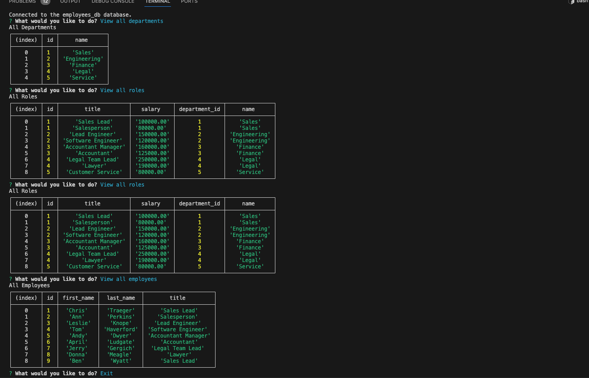

# Employee Tracker

## Are you having trouble staying on top of your small business employee tracking? Use this nifty tool to track your employees roles, salaries, departments, and make changes right there.

## Table of Contents
 
- [Installation](#installation)
- [Usage](#usage)
- [Credits](#credits)
- [License](#license)
- [Questions](#questions)

## Installation

In order to use this application, you will need to have a coding application and run an npm i for inquirer, and mysql2. 

## Usage/Tests

Once you're set up in the coding application of your choice, run node index.js in the terminal to start the Employee Tracker!  I've added some seeds to give you a template for you to fill in with your own employees, roles, departments, etc. Simply choose which menu item you'd like to see or change, then answer the prompted questions. Once finished, Employee tracker will display your new tables. 

  

## Contributing

The collaborators on this project include me, myself, and I -- tayskully
   

Tutorials followed include Columbia University EdX's Coding Bootcamp 2023, as well as:  
 [Github Docs](https://docs.github.com/en)  
 [developer mozilla](https://developer.mozilla.org/en-US/)  
 [Dev.to](https://dev.to/)  
 [Code Academy blogs](https://www.codecademy.com/resources/blog/)  
 [W3 Schools](https://www.w3schools.com/)

Special thanks to Katie Redford, my tutor,for the additional guidance 

## License 
    MIT License

## Questions

Reach out to me if you have any questions!
- Github: [tayskully](https://github.com/tayskully)
- LinkedIn: [linkedin.com/taylordaniellesullivan](https://www.linkedin.com/in/linkedin.com/taylordaniellesullivan/)
- Email: taysully94@gmail.com

---

## Badges

